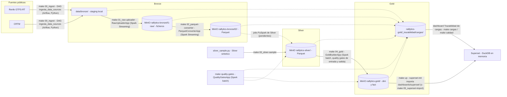

# RAILLYTICS

**Raillytics Light — Plataforma de Ingeniería de Datos para Análisis y Predicción de Demanda Ferroviaria en España**

Proyecto de TFM (Máster en Ingeniería de Datos — Grupo 3). Plataforma end-to-end que integra, procesa y analiza datos ferroviarios públicos (Renfe Open Data, AEMET, festivos BOE, INE) para generar insights operativos y predicciones de demanda a 30 días.

**Stack tecnológico:** Python (ingesta) · Apache Airflow (orquestación) · MinIO — S3-compatible (almacenamiento Bronze/Silver/Gold) · Spark Structured Streaming en Scala (subida a Bronze L1/L2) · PySpark (procesamiento Silver) · Delta Lake + Parquet (almacenamiento) · Spark en Scala, batch (modelo dimensional Gold; Snowflake en el diseño objetivo) · DuckDB (motor de consulta de Superset y notebooks sobre el Parquet del lake) · Apache Superset (dashboards en local; Power BI en el diseño objetivo) · Scikit-learn (modelo predictivo).

**Arquitectura:** patrón Medallion — Bronze (datos brutos) → Silver (datos limpios y enriquecidos) → Gold (modelo dimensional listo para consumo analítico).

---

## Equipo

- Elena Calcerrada Quiles
- Joaquín Ayllón Moreno
- Laura Rodríguez Mora
- Miguel Ángel Vicente Vicente
- Rubén Martínez Sierra

---

## Arquitectura de datos (Medallion)

Los datos fluyen por tres capas de calidad creciente:

```
Fuentes (Renfe, AEMET, BOE, INE)
        │  ingesta Python
        ▼
🥉 BRONZE ──► 🥈 SILVER ──► 🥇 GOLD ──────────────► Superset
   datos        PySpark        Spark (Scala) construye  (DuckDB lee el Parquet
   en bruto     limpieza       el modelo dimensional    de Gold en MinIO)
   (MinIO)      (MinIO)        y lo deja en Parquet
                               (MinIO)         └─ diseño objetivo: Snowflake ► Power BI
```

- **🥉 Bronze — datos en bruto**: un [framework de ingesta](#framework-de-ingesta-bronze) descarga las fuentes públicas y las promueve a MinIO en dos subcapas — `l1-raw` (tal cual llegan, sin transformar) y `l2` (mismo dato convertido a Parquet) — particionadas por fuente y fecha. Si algo falla después, siempre se puede volver al dato original en `l1-raw`.
- **🥈 Silver — datos limpios y enriquecidos**: jobs PySpark eliminan duplicados, tratan nulos, normalizan formatos (fechas, nombres de estaciones) y cruzan los viajeros con meteorología y festivos. Es la capa de "datos fiables".
- **🥇 Gold — datos listos para el análisis**: el modelo dimensional (dimensiones `Dim_Estacion`, `Dim_Linea`, `Dim_Fecha` y hechos `Fact_Viajeros`, `Fact_Puntualidad`). En este repositorio lo construye la app Spark [`GoldBuilderApp`](#capa-gold-con-spark-y-dashboards-en-superset) (Scala, batch) con SQL a partir de Silver y lo deja como Parquet en el bucket `raillytics-gold`; Superset lo consulta directamente desde ahí con DuckDB y el modelo predictivo de Scikit-learn puede leerlo igual. En el diseño del TFM el destino de este paso es Snowflake → Power BI: el SQL es el mismo y podrá ejecutarse allí cuando toque.

---

## Flujo de datos y procesos

Qué mueve los datos entre capas y con qué target de `make` se lanza cada paso. Las líneas
discontinuas hacia la trazabilidad indican que cada proceso registra sus cargas.




Cada proceso aplica además sus [Quality Gates](#quality-gates): la descarga valida el fichero recibido, L1
comprueba los bytes subidos, L2 la cabecera y los registros corruptos (lo que no pasa va a cuarentena en
`data/bronze_rejected/`), y `GoldBuilderApp` valida Silver antes de construir y Gold antes de escribir.
Los resultados quedan en `raillytics-gold/_trazabilidad/calidad/`, junto a las cargas.

---

## Estructura de directorios

```
RAILLYTICS/
├── README.md
├── G3.pdf                      # Documento de diseño del proyecto
├── Makefile                    # Targets para levantar infra y lanzar ingesta (Linux/Windows)
├── requirements.txt            # Dependencias Python del proyecto
├── .env.example                # Plantilla de variables de entorno (API keys, credenciales, MinIO, Airflow)
│
├── config/
│   ├── data_sources.yml        # Registro de fuentes (id, url, formato csv|json|zip) — lo leen Python y Scala
│   ├── quality_gates.yml       # Quality gates declarativos de Silver y Gold — los evalúa Spark (Scala)
│   ├── prediccion.yml          # Consultas de entrada de la predicción de demanda (lake -> contrato); las lee Python
│   └── prompts/                # Plantillas versionadas del prompt del LLM (demanda_v1.md, demanda_v2.md, ...)
│
├── docker/
│   ├── docker-compose.yml      # MinIO + Postgres + Airflow (LocalExecutor) + Superset + Ollama (perfil llm), local/desarrollo
│   ├── docker-compose.gpu.yml  # Override opcional: reserva de GPU NVIDIA para Ollama (LLM_GPU=1)
│   ├── init-buckets.sh         # Crea los buckets de MinIO (raillytics-bronze/-silver/-gold)
│   ├── postgres/               # init-databases.sh: crea la BD de Superset en el Postgres compartido con Airflow
│   └── superset/               # Imagen de Superset con driver DuckDB, superset_config.py y scripts de arranque/importación
│
├── dags/
│   └── ingesta_data_sources.py # DAG Airflow: descarga por fuente (dynamic task mapping sobre el YAML)
│
├── dashboards/
│   └── superset/raillytics_gold/  # Dashboards de Superset como código (Demanda, Puntualidad, Trazabilidad de cargas); se importan al arrancar
│
├── data/                       # Data Lake local — NO se versiona en git
│   ├── bronze/                 # Staging local por fuente — aquí escribe la descarga Python
│   ├── bronze_l1_done/         # Generado en runtime: ficheros ya subidos a MinIO L1, pendientes de L2
│   ├── bronze_processed/       # Generado en runtime: ficheros que ya completaron L1 y L2
│   ├── bronze_rejected/        # Generado en runtime: cuarentena (ficheros que no pasan un quality gate + .rechazo.txt)
│   ├── checkpoints/            # Generado en runtime: checkpoints de Spark Structured Streaming
│   ├── silver/                 # Datos limpios, normalizados y enriquecidos (Delta Lake)
│   ├── gold/                   # Sin uso en local: Gold vive en el bucket raillytics-gold de MinIO
│   └── predicciones/           # CSV de la predicción de demanda: <corredor>/<trimestre>/demanda_diaria_*.csv
│
├── python/
│   └── raillytics/
│       ├── ingesta/            # sources.py (registro YAML), formats.py, filenames.py, download.py (descarga a staging o cuarentena)
│       ├── calidad/            # Lado Python de los quality gates: ficheros.py (valida la descarga), registro.py (escribe resultados)
│       ├── procesamiento/      # Jobs PySpark de limpieza y enriquecimiento (capa Silver); silver_sample.py: Silver sintético
│       ├── ml/                 # Modelo predictivo Scikit-learn (features, entrenamiento, evaluación)
│       ├── prediccion/         # Predicción diaria de demanda AVE Madrid–Barcelona con un LLM de Ollama (make 06_prediccion)
│       └── utils/              # Comunes: fs.py (escritura atómica), lake.py (DuckDB + MinIO), cargas.py (trazabilidad de cargas)
│
├── build.sbt                   # Proyecto SBT (Scala 2.13 / Spark 4.2) en la raíz para que IntelliJ lo reconozca
├── project/                    # Metadatos del build SBT (build.properties)
├── src/
│   ├── main/scala/raillytics/
│   │   ├── common/             # Compartido: config (AppConfig, DotEnv), logging, spark (SparkSessionFactory), fs, lake (BronzePaths, LakeSettings, LakeViews),
│   │   │                       #   trazabilidad (Cargas), calidad (QualityGates: el framework de quality gates)
│   │   ├── ingesta/
│   │   │   ├── config/         # DataSource + DataSourceConfig (lectura de config/data_sources.yml)
│   │   │   ├── formats/        # SourceFormat: formatos soportados (csv, json, zip) y sus opciones de lectura
│   │   │   ├── l1/             # RawUploaderApp (main) · RawUploader (lógica) · RawUploaderSettings (entorno)
│   │   │   └── l2/             # ParquetConverterApp (main) · ParquetConverter (lógica) · ParquetConverterSettings (entorno)
│   │   ├── gold/               # GoldBuilderApp (main, batch) · GoldBuilder (lógica) · GoldBuilderSettings (entorno)
│   │   └── calidad/            # QualityGatesApp (main, batch): evalúa config/quality_gates.yml sobre el lake · QualityGatesSettings
│   ├── main/resources/
│   │   ├── application.conf    # Configuración de las apps Scala (Typesafe Config): claves, defaults y variables del .env
│   │   └── gold/               # El modelo Gold en dialecto Spark SQL (una consulta por tabla)
│   └── test/scala/raillytics/  # Tests ScalaTest (mismo árbol de paquetes que main)
│
├── notebooks/                  # Notebooks de exploración y análisis (EDA, validación de fuentes)
│
├── dashboards/                 # Ficheros Power BI (.pbix) y documentación de los 4 dashboards
│
├── tests/
│   ├── ingesta/                # Tests pytest del registro de fuentes, nombres de fichero y la descarga (incluida la cuarentena)
│   ├── calidad/                # Tests pytest de los gates de fichero y del registro de resultados
│   ├── procesamiento/          # Tests pytest del Silver sintético (contrato de columnas, festivos, determinismo, traza)
│   ├── utils/                  # Tests pytest de utilidades comunes (fs, lake, trazabilidad de cargas)
│   └── prediccion/             # Tests pytest de la predicción (el e2e con Ollama real lleva el marcador llm)
│
└── docs/                       # Documentación técnica y memoria del TFM
```

---

## Framework de ingesta Bronze

Para dar de alta una fuente nueva basta con añadir una entrada a `config/data_sources.yml`
(`id`, `name`, `url`, `format` — `csv`, `json` o `zip`). El resto del pipeline no necesita cambios:

```
config/data_sources.yml
        │
        ▼
DAG Airflow "ingesta_data_sources"  (una tarea de descarga por fuente)
        │   quality gates de fichero: no vacío, el contenido ES el formato declarado
        ├──► data/bronze_rejected/<source>/   ← cuarentena (+ <fichero>.rechazo.txt); la tarea falla
        ▼
data/bronze/<source>/                  ← Python escribe aquí (staging local)
        │
        ▼  App Scala "raw-uploader" (Spark Structured Streaming)
        │   copia el fichero tal cual a MinIO: raillytics-bronze/l1-raw/<source>/<fecha>/
        │   quality gate: bytes subidos = bytes del fichero local
        ▼
data/bronze_l1_done/<source>/
        │
        ▼  App Scala "parquet-converter" (Spark Structured Streaming, 1 query por fuente)
        │   convierte a Parquet en MinIO: raillytics-bronze/l2/<source>/<fecha>/  (zip: .../<fecha>/<miembro>/)
        │   quality gates: cabecera csv = esquema de la query, sin registros corruptos, zip válido
        ├──► data/bronze_rejected/<source>/   ← cuarentena; el resto del micro-batch se convierte
        ▼
data/bronze_processed/<source>/
```

Los formatos: `csv` (texto con cabecera), `json` (un único documento, como los feeds GTFS-RT
de Renfe) y `zip` (archivo cuyos miembros `.txt`/`.csv` se leen como CSV: es lo que sirve
CRTM, un GTFS estático con `stops.txt`, `routes.txt`, `trips.txt`...; L2 deja un prefijo
Parquet por miembro). La descarga comprueba que lo recibido es realmente ese formato:
antes, con CRTM declarado como `csv`, L2 convertía los bytes del ZIP a Parquet sin que
nada avisara.

Los directorios de `data/` son **hermanos, no anidados** — es un detalle de diseño
deliberado: Spark recorre recursivamente cualquier subdirectorio alcanzable bajo una ruta
que ya haya hecho *match* con un glob, así que anidarlos reintroduciría una carrera entre
las dos apps (cada una movería ficheros que la otra todavía no ha procesado).

Las dos apps son **idempotentes frente a reinicios**: si el proceso muere a mitad de un
micro-batch, Spark vuelve a entregar el mismo batch al arrancar. L1 omite los ficheros ya
movidos y vuelve a subir (sobrescribiendo) los que siguen en el staging; L2 deja un
marcador por batch en su checkpoint (`raillytics-batches/<batchId>`) y, si lo encuentra,
solo termina de mover ficheros sin volver a escribir Parquet (sin duplicados en `l2`).
Borrar `data/checkpoints/` reprocesa todo, marcadores incluidos.

### Arranque rápido (local)

Con Docker y `make` instalados (`choco install make` / `scoop install make` en Windows):

```bash
make install-dev-env        # crea .venv (Python 3.9–3.12), instala requirements.txt,
                            # activa los git hooks y copia .env.example -> .env
                            # (rellena las credenciales: nunca valores por defecto)
make up                     # levanta MinIO + Postgres + Airflow + Superset
make 00_ingest              # levanta Ollama y dispara el DAG de descarga una vez (+ predicción de demanda al final)
make 01_raw-uploader        # en una terminal aparte — app L1 (queda en primer plano)
make 02_parquet-converter   # en otra terminal aparte — app L2 (queda en primer plano)
make 03_silver-sample       # Silver sintético en MinIO (mientras no existan los jobs PySpark)
make quality-gates          # (opcional) valida Silver/Gold del lake con config/quality_gates.yml; falla si hay gates bloqueantes
make 04_gold                # construye la capa Gold con la app Spark -> Parquet en raillytics-gold
                            # (valida Silver a la entrada y Gold a la salida, antes de escribir)
                            # Superset: http://localhost:8088 (SUPERSET_ADMIN_USER / _PASSWORD del .env)
make cargas                 # últimas cargas registradas      make calidad   # últimos quality gates
```

`make help` lista todos los targets disponibles (`up`/`down`, `test`, `test-python`,
`test-scala`, `clean`, etc.).

Detrás de un proxy TLS corporativo (Zscaler) las descargas del DAG fallan dentro del
contenedor con `CERTIFICATE_VERIFY_FAILED`: deja el certificado raíz en `config/certs/`
(ignorado por git) y apunta `AIRFLOW_CA_BUNDLE` del `.env` a su ruta dentro del contenedor
(ver `.env.example`).

`install-dev-env` es idempotente: solo recrea el venv si no existe y solo reinstala
dependencias si cambia `requirements.txt`. Por defecto crea el venv con `py -3.12` en
Windows y `python3` en Linux/macOS (numpy 1.26 y pyarrow 16 no tienen wheels para
Python 3.13+); se puede cambiar con `make install-dev-env VENV_BASE_PYTHON=python3.11`.
Los targets que necesitan dependencias Python (`test-python`, `03_silver-sample`,
`cargas`) usan directamente el intérprete de `.venv`, así que no hace falta
activarlo antes de llamar a `make`.

### Configuración: `.env` y `application.conf`

Todo lo que depende de la máquina (puertos, credenciales, rutas locales, buckets) vive en el
`.env` de la raíz (plantilla en `.env.example`). Lo leen docker-compose (`env_file`), el Makefile
(que lo exporta a todos los subprocesos) y el lado Python (`python-dotenv`). Las apps Scala usan
[Typesafe Config](https://github.com/lightbend/config): las claves y sus valores por defecto están
en `src/main/resources/application.conf` (HOCON), y `raillytics.common.config.AppConfig` monta la
pila de fuentes con esta precedencia: propiedades de la JVM (`-Dclave=valor`) > variables de
entorno > `.env` del proyecto > `application.conf`. Como las apps y los tests leen el `.env`
directamente, funcionan igual desde `make`, desde `sbt` a secas o desde el IDE.

| Clave de `application.conf` | Variable del `.env` | Valor por defecto |
| --- | --- | --- |
| `raillytics.minio.endpoint`, `.user`, `.password` | `MINIO_ENDPOINT`, `MINIO_ROOT_USER`, `MINIO_ROOT_PASSWORD` | `http://localhost:9000`, vacíos |
| `raillytics.minio.buckets.{bronze,silver,gold}` | `MINIO_BUCKET_{BRONZE,SILVER,GOLD}` | `raillytics-bronze`, `-silver`, `-gold` |
| `raillytics.lake.{silver,gold,trazabilidad}-root` | `SILVER_ROOT`, `GOLD_ROOT`, `TRAZABILIDAD_ROOT` | `s3a://<bucket>`; trazabilidad: `<gold>/_trazabilidad` |
| `raillytics.ingesta.{data-sources,staging-root,l1-done-root,processed-root,rejected-root,checkpoint-root}` | `DATA_SOURCES_CONFIG`, `STAGING_ROOT`, `L1_DONE_ROOT`, `PROCESSED_ROOT`, `REJECTED_ROOT`, `CHECKPOINT_ROOT` | `config/data_sources.yml`, `data/bronze`, `data/bronze_l1_done`, `data/bronze_processed`, `data/bronze_rejected`, `data/checkpoints` |
| `raillytics.ingesta.l2.pending-retry` | — | `30 seconds` |
| `raillytics.spark.master`, `raillytics.spark.s3a.*` | `SPARK_MASTER` | `local[*]`; path-style sí, TLS no |
| `raillytics.gold.umbral-puntualidad-min` | — | `5` |
| `raillytics.calidad.config` | `QUALITY_GATES_CONFIG` | `config/quality_gates.yml` |
| — (solo docker-compose, contenedor de Airflow) | `AIRFLOW_CA_BUNDLE` | vacío (certificados del sistema) |

Los prefijos `l1-raw/` y `l2/` de Bronze y los nombres de las tablas Gold no están en la
configuración: son parte del contrato del lake, que también conocen Superset y el lado Python.

---

## Capa Gold con Spark y dashboards en Superset

En local la capa Gold no necesita un data warehouse: la app **Spark** `GoldBuilderApp`
(Scala, batch) construye el modelo dimensional leyendo Silver de MinIO y lo deja como Parquet
en el bucket `raillytics-gold`, y **Superset** lo consulta directamente desde ahí con
**DuckDB** en memoria dentro del contenedor. Es el mismo modelo que en el diseño del TFM
se carga en Snowflake; solo cambia el destino.

```
Silver (Parquet en MinIO)              Gold (Parquet en MinIO)                Superset (http://localhost:8088)
raillytics-silver/                     raillytics-gold/
  viajeros_enriquecidos/    Spark        dim_fecha/       dim_estacion/       DuckDB en memoria + httpfs:
  puntualidad_enriquecida/  ───────►     dim_linea/       fact_viajeros/  ◄── read_parquet('s3://raillytics-gold/...')
                         GoldBuilderApp  fact_puntualidad/
```

### Cómo se ejecuta

| Paso | Comando | Qué hace |
| --- | --- | --- |
| Silver de ejemplo | `make 03_silver-sample` | Genera un Silver sintético y determinista (365 días, semilla 42) en `raillytics-silver`. Sustituye a los jobs PySpark mientras no existan y produce exactamente las columnas que Gold espera (el contrato está en `python/raillytics/procesamiento/silver_sample.py`). Los datos no son reales. |
| Quality gates | `make quality-gates` | `sbt "runMain raillytics.calidad.QualityGatesApp"` (batch): evalúa `config/quality_gates.yml` sobre lo que hay en Silver y Gold, registra los resultados y termina con error si falla algún gate bloqueante. No escribe datos: es la barrera entre pasos. `QG_ARGS=silver`, `gold` o el nombre de una tabla acotan la evaluación. |
| Gold | `make 04_gold` | `sbt "runMain raillytics.gold.GoldBuilderApp"` (batch, con la misma configuración s3a que L1/L2): registra las tablas Silver como vistas, aplica los gates `silver_*` (entrada), ejecuta `src/main/resources/gold/<tabla>.sql` para todas las tablas en memoria, aplica los gates `gold_*` (salida) y solo entonces escribe cada tabla en `s3a://raillytics-gold/<tabla>/` (un `part-*.parquet` por tabla, full refresh). Si un gate bloqueante falla, Gold se queda como estaba. No es un stream como L1/L2 porque las dimensiones se recalculan sobre todo Silver. |
| Dashboards | `make up` (o `make 05_superset-import`) | El servicio `superset-init` importa `dashboards/superset/raillytics_gold/` en cada arranque; `05_superset-import` repite la importación sin reiniciar. |

Gold no tiene DAG de Airflow: la app Spark corre fuera de los contenedores, como L1/L2
(orquestarla desde Airflow requeriría un `SparkSubmitOperator` contra un clúster o una imagen
con JDK y sbt). Los dos comandos leen la configuración de MinIO de las variables `MINIO_*` del
`.env`; con `SILVER_ROOT`, `GOLD_ROOT` y `TRAZABILIDAD_ROOT` se puede apuntar a directorios
locales (así corren los tests, sin MinIO).

### Modelo Gold

| Tabla | Grano | Columnas principales |
| --- | --- | --- |
| `dim_fecha` | día | `fecha_id` (AAAAMMDD), `fecha`, `anio`, `trimestre`, `mes`, `nombre_mes`, `dia_semana` (1 = lunes), `nombre_dia`, `es_fin_de_semana`, `es_festivo`, `festivo_nombre`, `estacion_anio` |
| `dim_estacion` | estación | `estacion_id`, `nombre`, `provincia`, `comunidad`, `latitud`, `longitud` |
| `dim_linea` | línea | `linea_id`, `nombre`, `tipo_tren`, `origen`, `destino` |
| `fact_viajeros` | día × estación × línea | `fecha_id`, `fecha`, `estacion_id`, `linea_id`, `viajeros`, `temperatura_media`, `precipitacion_mm`, `condicion_meteo` |
| `fact_puntualidad` | servicio (tren) | `fecha_id`, `fecha`, `linea_id`, `estacion_id`, `servicio_id`, `hora_prevista`, `hora_real`, `hora`, `retraso_min`, `estado`, `cancelado`, `es_puntual` (retraso ≤ 5 min), meteo |

### Superset

- **Conexión**: la base de datos `Raillytics Gold (DuckDB)` es `duckdb:///:memory:` con la
  extensión `httpfs` precargada. Al arrancar, el contenedor guarda las credenciales de MinIO del
  `.env` como *secret* persistente de DuckDB (`docker/superset/superset-run.sh` ejecuta
  `python -m raillytics.utils.lake persist-secret`), así el YAML versionado no contiene
  credenciales. En SQL Lab se puede consultar Gold tal cual:
  `SELECT * FROM read_parquet('s3://raillytics-gold/dim_linea/*.parquet')`.
- **Datasets**: dos datasets virtuales que hacen el *star join* de cada tabla de hechos con sus
  dimensiones (`viajeros_diarios` y `puntualidad_servicios`), con las métricas guardadas
  (`total_viajeros`, `media_viajeros_dia`, `pct_puntuales`, `retraso_medio`, `retraso_p90`...).
- **Dashboards de ejemplo** (los dos primeros del diseño): *Demanda ferroviaria* (viajeros por
  estación, evolución por tipo de tren, día de la semana, festivos, meteorología, comunidades) y
  *Puntualidad* (% puntuales, retraso medio, evolución mensual y diaria, tabla por línea, franja
  horaria × tipo de tren, meteorología, estaciones críticas), con filtros nativos de fechas,
  tipo de tren, comunidad y línea. El tercero, *Trazabilidad de cargas*, se describe más abajo.
- **Metastore**: Superset guarda sus metadatos en la base de datos `superset` del mismo Postgres
  que usa Airflow (servicio `postgres`, variables `POSTGRES_USER`/`POSTGRES_PASSWORD` del `.env`);
  `docker/postgres/init-databases.sh` la crea al inicializar el volumen.
- **Dashboards como código**: `dashboards/superset/raillytics_gold/` está en el formato de
  exportación de Superset (`metadata.yaml` + `databases/`, `datasets/`, `charts/`, `dashboards/`).
  Para cambiar un dashboard: edítalo en la UI, expórtalo (Dashboards → Export), descomprime el
  ZIP sobre esa carpeta y haz commit. Al importar, los dashboards se sobrescriben, pero la base
  de datos, los datasets y los charts se identifican por `uuid` y se conservan si ya existen
  (para rehacerlos desde el YAML hay que borrarlos antes en la UI o cambiar su `uuid`).
- **Imagen**: `docker/superset/Dockerfile` añade a `apache/superset:6.1.0` los drivers `duckdb`,
  `duckdb-engine` y `psycopg2` (metastore en Postgres) y deja `httpfs` instalada para no depender
  de internet en runtime. Se construye sola la primera vez; para reconstruirla:
  `docker compose -f docker/docker-compose.yml --env-file .env build superset`.
- **Limitaciones**: el nombre del bucket (`raillytics-gold`) va escrito en el SQL de los datasets;
  si cambias `MINIO_BUCKET_GOLD` hay que actualizarlo también ahí. No hay Redis ni Celery (un solo
  worker de gunicorn), suficiente para desarrollo.

### Trazabilidad de cargas

Cada proceso de carga deja constancia de lo que ha hecho en una tabla Parquet del lake,
`s3://raillytics-gold/_trazabilidad/cargas/` (un fichero por ejecución, una fila por tabla
cargada): `run_id`, `proceso`, `capa`, `tabla`, `origen`, `destino`, `filas`, `bytes`,
`inicio`/`fin` (UTC), `duracion_s`, `estado` (`ok`/`error`), `error`, `parametros` (JSON),
`lanzado_por` (`make`, `airflow:<dag>`, `cli`), `ejecutor` y `usuario`. Ya lo hacen la descarga
Bronze del DAG `ingesta_data_sources`, las apps Spark L1 (`bronze_l1_raw_uploader`: una fila por
fichero subido, dentro de cada micro-batch de Structured Streaming) y L2
(`bronze_l2_parquet_converter`: una fila por micro-batch y fuente, más una en `error` por cada
fichero enviado a cuarentena), el Silver sintético (`silver_sample`), la construcción de Gold
(`gold_build`) y la validación del lake (`quality_gates`).

Para instrumentar un proceso nuevo basta con envolverlo. En Python
(`python/raillytics/utils/cargas.py`):

```python
from raillytics.utils.cargas import registrar_carga

with registrar_carga("silver_viajeros", "silver", layout, con, parametros={...}) as ejecucion:
    with ejecucion.tabla("viajeros_enriquecidos", origen=..., destino=...) as carga:
        ...                 # la carga propiamente dicha
        carga.filas = n
```

Y en Scala (`raillytics.common.trazabilidad.Cargas`, mismo esquema Parquet; Spark añade sus
`part-*.parquet` al mismo prefijo y DuckDB los lee junto a los de Python):

```scala
Cargas.registrar("silver_viajeros", "silver", settings.cargasDir, Map("particion" -> dia)) { ejecucion =>
  ejecucion.tabla("viajeros_enriquecidos", origen = Some(...), destino = Some(...)) { carga =>
    ...                   // la carga propiamente dicha
    carga.filas = Some(n)
  }
}
```

El registro se escribe al terminar, también si la carga falla (el error queda en la fila y la
excepción se propaga); si el registro no se puede escribir, se avisa en el log pero la carga no
falla por eso. `make cargas` lista las últimas ejecuciones desde la terminal, y el dashboard
*Trazabilidad de cargas* de Superset muestra ejecuciones, errores, filas cargadas por día y
tabla, duración por proceso, la última carga de cada tabla (en rojo si hace más de 24 h), los
quality gates de cada carga y el historial completo. `TRAZABILIDAD_ROOT` cambia la ubicación
del registro (por defecto, dentro del bucket Gold).

Junto a `cargas/` vive `_trazabilidad/calidad/`, con una fila por quality gate evaluado y el
**mismo `run_id`** que la carga a la que pertenece (ver [Quality Gates](#quality-gates)).

---

## Quality Gates

Un *quality gate* es una comprobación que decide si una carga se promociona o no. El
framework vive en Scala (`raillytics.common.calidad.QualityGates`) y usa Spark SQL como
motor: los gates se declaran por tabla en `config/quality_gates.yml`, se traducen a una
consulta que devuelve un número y se comparan con un umbral. Cada gate tiene una severidad:

- **bloqueante**: si falla (o no se puede evaluar: fail closed), el proceso lanza
  `QualityGateException`, la carga queda con `estado = error` en la trazabilidad y **no se
  escribe nada** en la capa destino.
- **aviso**: se registra y la carga sigue.

Las tablas se nombran `<capa>_<tabla>` (`silver_viajeros_enriquecidos`, `gold_dim_fecha`...),
que son las vistas que registran las apps (`LakeViews`). Tipos disponibles:

| Tipo | Parámetros | Pasa si |
| --- | --- | --- |
| `filas_min` | `minimo` | `count(*) >= minimo` |
| `no_nulos` | `columnas` | ninguna fila tiene nulos en esas columnas |
| `unico` | `columnas` | no hay filas duplicadas por esas columnas (clave o grano) |
| `dominio` | `columna`, `valores` | ningún valor fuera de la lista |
| `rango` | `columna`, `minimo` y/o `maximo` | ningún valor fuera de `[minimo, maximo]` |
| `referencia` | `columnas`, `tabla`, `columnas_destino?` | toda clave existe en la tabla destino (integridad referencial) |
| `sql` | `sql`, `maximo` (0 por defecto), `minimo?` | la consulta (que devuelve un número) queda dentro del umbral; sirve para cruzar tablas, p. ej. conciliar filas y sumas de Gold con Silver |

```yaml
tablas:
  gold_fact_viajeros:
    - {nombre: grano_unico,         tipo: unico,      columnas: [fecha_id, estacion_id, linea_id], severidad: bloqueante}
    - {nombre: lineas_en_dim_linea, tipo: referencia, columnas: [linea_id], tabla: gold_dim_linea,  severidad: bloqueante}
    - {nombre: viajeros_conciliados, tipo: sql, severidad: bloqueante,
       sql: "SELECT abs((SELECT sum(viajeros) FROM gold_fact_viajeros) - (SELECT sum(viajeros) FROM silver_viajeros_enriquecidos))"}
```

Dónde se aplican:

| Paso | Gates | Qué pasa si fallan |
| --- | --- | --- |
| Descarga (Python, DAG) | `contenido_no_vacio`, `formato_declarado` (el contenido es realmente csv/json/zip), `content_type` (aviso) | el fichero va a `data/bronze_rejected/<fuente>/` con un `.rechazo.txt`; la tarea de Airflow falla |
| L1 `RawUploaderApp` | `bytes_subidos` (lo que hay en MinIO pesa lo mismo que el fichero local) | se borra el objeto de Bronze y el micro-batch falla; al reiniciar se vuelve a subir |
| L2 `ParquetConverterApp` | `cabecera_csv`, `registros_corruptos`, `zip_valido` (bloqueantes por fichero), `filas_convertidas` (aviso) | el fichero va a cuarentena con `estado = error` en la trazabilidad; el resto del micro-batch se convierte |
| `GoldBuilderApp` | gates `silver_*` a la entrada, gates `gold_*` a la salida (antes de escribir) | no se escribe ninguna tabla Gold; la carga queda en error |
| `QualityGatesApp` (`make quality-gates`) | todos los del YAML (o `QG_ARGS=silver`, `gold`, `<tabla>`) | el proceso termina con código de error: sirve como barrera entre `make 03_silver-sample` y `make 04_gold`, o para auditar el lake |

Los resultados se guardan en `s3://raillytics-gold/_trazabilidad/calidad/` (Parquet: `run_id`,
`proceso`, `capa`, `tabla`, `gate`, `tipo`, `severidad`, `resultado` (`ok`/`fallo`/`error`),
`valor`, `umbral`, `detalle`, `inicio`/`fin`, `duracion_s`, `lanzado_por`, `ejecutor`,
`usuario`), con el `run_id` de la carga. `make calidad` los lista desde la terminal y el
dashboard *Trazabilidad de cargas* tiene una fila de KPIs (gates bloqueantes fallidos, % OK,
gates por tabla) y el historial. Para añadir un gate basta con una línea en el YAML; para
un tipo nuevo, una rama en `QualityGates.Gate.consulta`. El lado Python
(`raillytics.calidad`) solo aporta los gates de fichero de la descarga y escribe el mismo
esquema Parquet.

### Uso desde notebooks

DuckDB lee el Parquet de Gold directamente de MinIO, sin catálogo intermedio:

```python
from dotenv import find_dotenv, load_dotenv
from raillytics.utils.lake import LakeLayout, S3Settings, connect

load_dotenv(find_dotenv(usecwd=True))  # MINIO_* del .env (lo busca hacia arriba desde el directorio actual)
layout, con = LakeLayout.from_env(), connect(S3Settings.from_env())
con.sql(f"""
    SELECT l.tipo_tren, sum(f.viajeros) AS viajeros
    FROM read_parquet('{layout.gold_glob("fact_viajeros")}') f
    JOIN read_parquet('{layout.gold_glob("dim_linea")}') l USING (linea_id)
    GROUP BY 1 ORDER BY 2 DESC
""").show()
```

(El kernel necesita `python/` en el `PYTHONPATH`, por ejemplo con `sys.path.insert(0, "../python")`
desde `notebooks/`, o instalando el paquete en modo editable.)

---

## Predicción diaria de demanda con un LLM (Ollama)

Para un trimestre objetivo, predice la demanda **por día** del corredor **AVE Madrid–Barcelona** (línea
`AVE-MAD-BCN`, ambos sentidos sumados) y la guarda en un CSV. El reparto de trabajo es deliberado:

- El **código fija el nivel**: total del trimestre = el mismo trimestre del año anterior × el crecimiento
  interanual del último trimestre publicado (`raillytics.prediccion.nivel`).
- El **LLM da la forma**: recibe el calendario día a día (festivos, eventos, meteo) y devuelve un índice
  relativo por día (1.0 = laborable típico) con un motivo. El código normaliza los índices para que la suma
  sea **exactamente** el total, valida el resultado con quality gates y escribe el CSV.

Se hace así porque los LLM razonan bien sobre el contexto (un puente, un partido) pero son malos haciendo
aritmética: dejarles inventar el nivel absoluto es la fuente de error más probable.

```
Airflow ──► lake (Bronze/Silver) ──► entradas ──► nivel ─┐
(trimestrales, festivos,                  calendario ────┼─► prompt ──► Ollama ──► índices ──► normalizar
 eventos, meteo)                                          ┘                                        │
                                                    CSV  ◄── gates (bloqueantes y avisos) ◄───────┘
```

### Cómo se usa

```bash
make llm-up                           # Ollama + modelo (LLM_GPU=1 en el .env reserva la GPU NVIDIA)
make 06_prediccion TRIMESTRE=2026-T4  # predice el trimestre y escribe el CSV
make 06_prediccion TRIMESTRE=2026-T4 PRED_ARGS="--solo-nivel"            # solo calcula el total esperado (sin LLM)
make 06_prediccion TRIMESTRE=2026-T4 PRED_ARGS="--total-esperado 4200000" # fija el total a mano
make 06_prediccion TRIMESTRE=2026-T4 PRED_PROMPT=demanda_v2 PRED_ARGS="--mostrar-prompt"   # imprime el prompt y termina (sin LLM)
make llm-down
```

`--solo-nivel` (calcula el total y termina) y `--mostrar-prompt` (imprime el prompt exacto y termina) no llaman al LLM: sirven para iterar sin gastar minutos de GPU. Si el trimestre ya está
publicado, se relanza como **backtest** (el nivel nunca mira al propio trimestre) y se informa de cuánto se
desvió el total esperado del real.

### Encadenada con la ingesta: `make 00_ingest`

`make 00_ingest` levanta Ollama (`make llm-up`) y dispara el DAG `ingesta_data_sources` con la predicción al final
(`predecir=true` en su conf). Es la tarea `predecir`, que llama a `raillytics.prediccion.servicio.predecir_desde_entorno`:

```bash
make 00_ingest                                  # ingesta + predicción del trimestre en curso
make 00_ingest TRIMESTRE=2026-T4 PRED_PROMPT=demanda_v3
```

- **Solo a petición.** Las ejecuciones programadas del DAG (`@daily`) solo ingestan: la tarea se salta si la conf no
  trae `predecir`. Una predicción diaria gastaría minutos de GPU para un dato que cambia cada trimestre.
- **No espera a L1/L2.** Esas apps Spark corren fuera de Airflow, así que la predicción usa lo que ya esté procesado en
  el lake, no las descargas de esta misma ejecución. La tarea corre aunque falle la descarga de alguna fuente.
- **Trimestre:** `TRIMESTRE=` o, si falta, el trimestre en curso según la fecha de ejecución.
- **Salida:** `data/predicciones/AVE-MAD-BCN/<trimestre>/…csv`, escrito desde el contenedor de Airflow.
- **Antes de usarlo** (una sola vez): Airflow necesita las variables nuevas del compose (`make up` recrea los servicios
  cuyo `docker-compose.yml` cambió) y poder escribir en `data/`: pon `AIRFLOW_UID=$(id -u)` en el `.env` y recrea el
  stack (`make down && make up`); sin eso la tarea falla con un mensaje que lo explica.
- **Las fuentes:** `00_ingest` solo descarga lo que esté en `config/data_sources.yml`. Da de alta ahí las cuatro de la
  predicción (demanda trimestral, festivos, eventos y meteo) cuando tengas sus URLs; el DAG descarga URLs directas en
  `csv`, `json` o `zip`. Sin esos datos en el lake, la tarea falla cerrada diciendo qué origen no se pudo leer.

### Entradas (las deja Airflow)

La ingesta de los cuatro orígenes (demanda trimestral, festivos, eventos, meteo) la hacen los DAGs de Airflow
(`config/data_sources.yml`). Esta predicción solo los lee: `config/prediccion.yml` define, **para cada origen, un
`SELECT` de DuckDB** que traduce lo que haya en el lake a un contrato fijo (columnas documentadas en el propio
fichero). **Las rutas y columnas de origen que trae son supuestas: ajústalas cuando Airflow haya ingestado las
fuentes.** Si un origen falta o no cumple el contrato, la predicción falla con el nombre de la fuente y la ruta
consultada, y no escribe nada.

La meteo de un trimestre futuro **no es una previsión** (AEMET prevé a ~7 días): para los días sin dato observado
se usa la **climatología** (promedio histórico del mes y la ciudad) y el prompt la marca como tal.

### Salida

`<PREDICCIONES_ROOT>/AVE-MAD-BCN/<trimestre>/demanda_diaria_<trimestre>_<prompt>_<AAAAMMDDThhmmssZ>.csv`
(`PREDICCIONES_ROOT` = `data/predicciones` por defecto). Un fichero por ejecución: nunca se sobrescribe otro.
UTF-8, cabecera, separador `,`, decimal `.`.

| Columna | Contenido |
| --- | --- |
| `fecha` | día, `AAAA-MM-DD` |
| `corredor` | `AVE-MAD-BCN` |
| `viajeros_previstos` | entero; la suma del CSV es exactamente el total esperado |
| `indice` | índice normalizado (media del trimestre = 1.0) |
| `motivo` | justificación del LLM |
| `trimestre` | `AAAA-Tn` |
| `modelo`, `version_prompt` | p. ej. `mistral-nemo`, `demanda_v2` |
| `run_id`, `generado_en` | enlaza con `_trazabilidad/cargas/`; hora UTC |

Cada ejecución queda en la trazabilidad (`proceso = prediccion_demanda`, `capa = ml`, con trimestre, modelo,
versión del prompt y semilla en `parametros`) y sus quality gates en `_trazabilidad/calidad/`. Bloqueantes: un
registro por día, sin nulos, viajeros ≥ 0, índices del LLM en [0.2, 3.0] y suma = total. Avisos: índices casi planos y
trimestre sin datos de eventos.

### El prompt: un fichero de texto versionado

El prompt **no está en el código**: es un fichero de texto plano, `config/prompts/demanda_vN.md`, con marcadores
`{{...}}` que el código rellena (`corredor`, `trimestre`, `num_dias`, `total_esperado`, `historico`, `nota_eventos`,
`calendario`). Se elige con `PRED_PROMPT` (por defecto `demanda_v2`; no se llama `PROMPT` porque `cmd.exe` ya define
esa variable). `demanda_v1.md` se conserva como línea base.

`demanda_v2.md` aplica estas prácticas, elegidas midiendo variantes con el modelo real y no por opinión:

- **Secciones delimitadas** (`<rol>`, `<tarea>`, `<criterios>`, `<contexto>`, `<ejemplo>`, `<calendario>`,
  `<respuesta>`): separan las instrucciones de los datos, y los datos largos (el calendario) van después de las
  instrucciones y del ejemplo.
- **Criterios numéricos explícitos** (valor de partida por día de la semana, festivos y eventos) en vez de «suele
  ser más alto». **Son hipótesis de partida, no datos**: ajústalos.
- **Un ejemplo** con la salida exacta esperada, en fechas ficticias (un test comprueba que cumple el contrato).
- **Razonar antes de decidir**: en el JSON el `motivo` va *antes* del `indice` (el schema fuerza ese orden).
- **El día de la semana viene dado** en cada línea del calendario y se pide usarlo: los LLM calculan mal los días.
- **El calendario se declara como datos, no instrucciones**: los textos de los eventos vienen de fuentes externas.
- Una sola tarea y respuesta solo JSON con el formato explícito.

Medido el 2026-10-01 con `mistral-nemo` sobre el calendario de 2026-T4 (festivos y eventos de prueba):

| | v1 | v2 |
| --- | --- | --- |
| Días que siguen la rúbrica semanal (±0.10) | 46 de 78 | **78 de 78** |
| Índice medio de un festivo entre semana (laborable = 1.0) | 1.32 | **0.73** |
| Motivos con el día de la semana equivocado | 1 | **0** |
| Valores de índice distintos | 6 | **10** |

Probado y **no incorporado** por no mejorar: separar en mensaje de sistema y de usuario (66 de 78) y calcular en
código marcas de víspera/puente (76 de 78). **Limitación conocida:** ninguna variante aplica el ajuste de víspera
(el índice medio de las vísperas sale ≈ 1.0); si te importa, habría que calcular ese ajuste en código.

### Iterar el prompt

Copia `demanda_v2.md` a `demanda_v3.md`, edítalo y lánzalo con `PRED_PROMPT=demanda_v3`. Los marcadores `{{...}}`
disponibles están en `raillytics.prediccion.prompt`. **No hay
verdad externa con la que medir la forma diaria** (solo existen totales trimestrales), así que cada ejecución
imprime un resumen de coherencia: índice medio de laborables, fines de semana, festivos y días con evento, y la
dispersión. Úsalo para comparar versiones: un festivo con índice 1.0 o un fin de semana igual que un laborable
indican que el prompt no está haciendo su trabajo. La suma diaria frente al total publicado mide solo el
**nivel** (`--solo-nivel` lo da sin LLM), no el prompt.

### Modelo y rendimiento

Medido el 2026-10-01 con 92 días (≈5.700 tokens de prompt y ≈4.000 de respuesta) en una RTX 2080 Ti de 11 GB:

| Modelo | Reparto CPU/GPU | Tiempo | Notas |
| --- | --- | --- | --- |
| `mistral-nemo` (por defecto) | 6 % / 94 % | ~150 s | Cabe casi entero en la GPU |
| `phi4` | 29 % / 71 % | ~480 s | No cabe entero a `num_ctx` 12288 |

`OLLAMA_NUM_CTX` debe ser ≥ ~10.000 para 92 días: con menos, Ollama trunca el prompt en silencio (la predicción
lo detecta y falla pidiendo subirlo). Cambiar de modelo es `OLLAMA_MODEL` en el `.env` y `make llm-up`.

**Los modelos persisten.** Ollama guarda sus modelos en un volumen Docker con nombre (`docker_ollama_data`) que no borran `make llm-down` ni `make down`: cada modelo se descarga **una sola vez**, y `make llm-up` lo avisa («ya descargado») en vez de volver a bajarlo. Solo se pierde con `docker volume rm docker_ollama_data`. Para reutilizar los modelos de un Ollama instalado en el host, apunta `OLLAMA_MODELS_DIR` a su directorio (p. ej. `~/.ollama`).

### Si algo falla

| Mensaje | Qué hacer |
| --- | --- |
| `no se puede conectar con Ollama` | `make llm-up` |
| `el modelo '…' no está` | `ollama pull <modelo>` o `make llm-up` |
| `origen '…': no se pudo leer` | Airflow no ha ingestado esa fuente, o la ruta de `config/prediccion.yml` no es la real |
| `faltan trimestres publicados` | Falta el mismo trimestre del año anterior (o el de referencia); usa `--total-esperado N` |
| `se cortó por falta de contexto` | Sube `OLLAMA_NUM_CTX` |
| `Ollama no respondió en N s` | Sube `OLLAMA_TIMEOUT_S` o usa un modelo más rápido |
| `quality gate(s) bloqueante(s)` | No se escribió nada; el detalle de cada gate está en `make calidad` |

La prueba extremo a extremo con un Ollama real lleva el marcador `llm` y no entra en `make test`:
`.venv/bin/python -m pytest -m llm -v -s`.

---

## Git hooks

El repositorio incluye hooks versionados en `.githooks/` (no en `.git/hooks/`, que no se versiona):

- **pre-commit**: si hay ficheros `.scala`/`.sbt`/`project/**` en staging, ejecuta `sbt compile` y bloquea el commit si falla.
- **pre-push**: si el push incluye cambios en `.scala`/`.sbt`/`project/**`, ejecuta `sbt test` y bloquea el push si falla.

Ambos se omiten (sin ejecutar sbt) si no hay cambios relevantes en Scala/SBT, para no ralentizar commits de Python/Airflow.

En Windows, las suites de Spark escriben en disco local y Hadoop necesita `winutils.exe` para ello:
la ruta se define en `HADOOP_HOME` dentro del `.env` (ver `.env.example`). El Makefile la exporta a
sbt, pero el hook lanza `sbt test` con el entorno del shell (o del IDE) desde el que se hace push,
sin pasar por make: si la variable no está en el entorno, los tests la leen del `.env`
(`src/test/scala/raillytics/testutil/TestSpark.scala`).

Activación local (una sola vez por clon del repo): `make install-hooks`, o directamente:

```bash
# Linux / macOS
./scripts/install-githooks.sh

# Windows (PowerShell)
.\scripts\install-githooks.ps1
```

Las tres formas hacen lo mismo: `git config core.hooksPath .githooks` (y en Linux/macOS marcan los hooks como ejecutables).

---

## Criterios de nombrado de ramas

| Rama         | Propósito                                                                                          |
| ------------ | -------------------------------------------------------------------------------------------------- |
| `main`       | Rama estable. Solo recibe merges desde `develop` vía Pull Request. Nunca se hace commit directo.   |
| `develop`    | Rama de integración. Todo el trabajo diario se fusiona aquí mediante PRs.                          |
| `feat_*`     | Nueva funcionalidad. Ej.: `feat_ingesta_renfe`, `feat_modelo_demanda`.                             |
| `fix_*`      | Corrección de errores. Ej.: `fix_nulos_aemet`.                                                     |
| `docs_*`     | Cambios de documentación. Ej.: `docs_memoria_tfm`.                                                 |
| `refactor_*` | Mejoras de código sin cambio funcional. Ej.: `refactor_jobs_silver`.                               |

Reglas de nombrado:

- Todo en **minúsculas**, palabras separadas por guion bajo (`_`).
- Nombre descriptivo y corto, en castellano: `feat_dashboard_puntualidad`, no `feat_cosas`.
- Una rama = un objetivo. Si la tarea crece, se divide en varias ramas.
- Las ramas parten siempre de `develop` actualizado (`git pull` antes de crearla).

---

## Modo de trabajo con Pull Requests

1. **Crear la rama** desde `develop`:
   ```bash
   git checkout develop
   git pull origin develop
   git checkout -b feat_nombre_descriptivo
   ```
2. **Desarrollar y commitear** con mensajes claros en castellano, en imperativo y con prefijo del tipo de cambio: `feat: añade ingesta de festivos BOE`, `fix: corrige duplicados en viajeros`.
3. **Publicar la rama y abrir la PR** contra `develop`:
   ```bash
   git push -u origin feat_nombre_descriptivo
   ```
   La PR debe incluir: descripción del cambio, motivación y cómo probarlo.
4. **Revisión obligatoria**: al menos **1 aprobación** de otro miembro del equipo antes de fusionar. El autor no aprueba su propia PR.
5. **Merge a `develop`**: preferiblemente con *squash merge* para mantener el historial limpio. La rama se elimina tras el merge.
6. **Merge a `main`**: solo desde `develop`, al cerrar un hito (fin de capa Bronze, Silver, Gold, modelo, dashboards…), mediante PR revisada por el equipo.

Normas generales:

- Nunca hacer `push` directo a `main` ni a `develop`.
- PRs pequeñas y frecuentes: más fáciles de revisar que una PR gigante.
- Resolver los conflictos en la rama de la feature (rebase o merge de `develop` hacia la rama), nunca en `develop`.

Para descargar o levantar el entorno:
   ```bash
   docker compose -f docker/docker-compose.yml --env-file .env pull
   ```