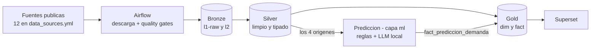
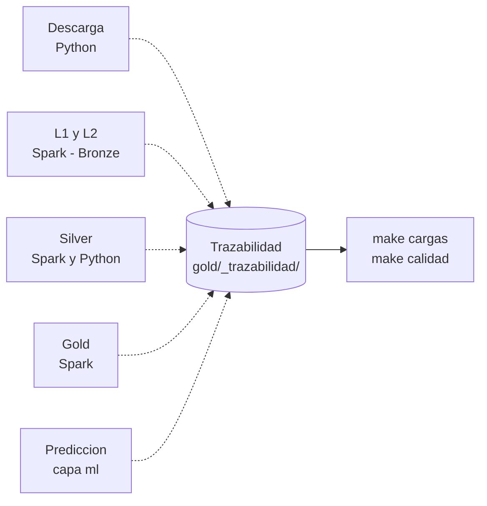

# Arquitectura: el recorrido del dato

Por dónde pasa un dato desde que se descarga hasta que alguien lo mira, qué componente lo toca en
cada tramo y qué ficheros intervienen. El README tiene el detalle de cada pieza; esto es el mapa.

- [El camino principal](#el-camino-principal)
- [Por qué parece que Bronze escribe en Gold](#por-qué-parece-que-bronze-escribe-en-gold)
- [Paso a paso, con sus ficheros](#paso-a-paso-con-sus-ficheros)
- [Cómo se arranca](#cómo-se-arranca)
- [Lo real y lo sintético](#lo-real-y-lo-sintético)

---

## El camino principal



Cada tramo del camino principal deja el dato más limpio, pero **la predicción no sigue ese camino**:
lee de Silver y escribe directamente en Gold. No limpia datos, los **crea** — coge el total de un
trimestre de la CNMC y lo reparte entre sus 90 días, que es un dato que nadie publica.

---

## Por qué parece que Bronze escribe en Gold

En el diagrama del README hay líneas punteadas que van de Bronze a Gold saltándose Silver. **No
llevan datos.**



Cada proceso, esté en la capa que esté, apunta en un cuaderno común qué ha cargado, cuántas filas y
si fue bien. Ese cuaderno vive en el bucket de Gold porque es una tabla que se consulta.

**Es el albarán, no el camión.**

---

## Paso a paso, con sus ficheros

### Origen · las 12 fuentes

Todo lo que entra está declarado en `config/data_sources.yml`. Dar de alta una fuente nueva son seis
líneas ahí: no hay que tocar código, porque el DAG lee ese fichero.

| familia | formato | qué trae |
| --- | --- | --- |
| `cnmc_*` (3) | csv | viajeros, plazas, precios e ingresos por trimestre |
| `aemet_*` (2) | json | climatología diaria de Madrid-Barajas y Barcelona-El Prat |
| `nap_gtfs_*` (2) | zip | horarios publicados de Renfe y OUIGO |
| `boe_calendario_laboral_*` (2) | xml | festivos nacionales y por comunidad |
| `renfe_*` (2) | json | posición y retrasos de los trenes en tiempo real |
| `crtm` (1) | zip | GTFS de Madrid; ejemplo del framework |

### Paso 1 · descarga y quality gates — `make 00_ingest`

Airflow se despierta una vez al día y baja cada fuente. Antes de dejarla entrar comprueba que el
fichero **es lo que dice ser**: un csv con sus columnas, un xml bien formado, un zip que abre. Lo que
no pasa va a cuarentena en vez de contaminar el pipeline.

- `dags/ingesta_data_sources.py` — el DAG, `@daily`
- `python/raillytics/ingesta/download.py`
- `python/raillytics/ingesta/downloaders.py` — AEMET y el NAP no son una descarga normal: uno
  responde con un enlace temporal, el otro obliga a listar snapshots y seguir una URL firmada
- `python/raillytics/ingesta/sources.py` y `formats.py` — validan el registro
- `python/raillytics/calidad/ficheros.py` — los gates

→ `data/bronze/` y lo rechazado en `data/bronze_rejected/`

### Paso 2 · Bronze, el fichero tal cual — `make 01_raw-uploader`

Sube el fichero sin tocarlo. Es la copia de seguridad de la realidad: si más adelante resulta que lo
interpretamos mal, aquí está el original.

- `src/main/scala/raillytics/ingesta/l1/RawUploader.scala` (Spark Streaming)

→ `s3://raillytics-bronze/l1-raw/`

### Paso 3 · Bronze, a Parquet — `make 02_parquet-converter`

Convierte cada fichero a Parquet, que es como un csv pero comprimido y mucho más rápido de leer.
Aquí es donde importa el formato declarado: un xml necesita saber qué elemento es una fila.

- `src/main/scala/raillytics/ingesta/l2/ParquetConverter.scala`
- `.../ingesta/formats/SourceFormat.scala` — cómo se lee cada formato
- `.../ingesta/config/DataSourceConfig.scala` — lee el registro desde Scala

→ `s3://raillytics-bronze/l2/`

### Paso 4 · Silver, limpio y con tipos — `make 04_silver`

Fechas que son fechas, números que son números, sin duplicados. Una tabla por cosa. **Aquí conviene
tener clara una mezcla**: no todo lo que hay en Silver es real.

**Real, de la CNMC**
- `src/main/scala/raillytics/silver/SilverBuilder.scala`
- `src/main/resources/silver/*.sql` — 3 ficheros, los tres de CNMC

**Sintético** — `make 03_silver-sample`
- `python/raillytics/procesamiento/silver_sample.py`
- produce `viajeros_enriquecidos` y `puntualidad_enriquecida`

> Los jobs reales de Silver para esas dos tablas **no existen todavía**, y de ellas comen dos de los
> hechos de Gold. Lo dice la cabecera del propio `silver_sample.py`.

**Tablas de referencia** — cargas iniciales, no van en el DAG
- `python/raillytics/ingesta/boe_festivos.py` → `festivos` (`make festivos`)
- `python/raillytics/ingesta/aemet_historico.py` → `meteo` (`make meteo`)
- `python/raillytics/ingesta/nap_historico.py` + `nap_oferta.py` → `oferta_diaria` (`make nap-oferta`)
- `python/raillytics/ingesta/referencia.py` — las escribe en el lago y registra la carga

→ `s3://raillytics-silver/`

### Paso 5 · Gold — `make 05_gold`

Tablas preparadas para responder rápido: los hechos y las dimensiones.

- `src/main/scala/raillytics/gold/GoldBuilder.scala`
- `src/main/resources/gold/*.sql` — 9 ficheros: 4 dimensiones y 5 hechos

→ `s3://raillytics-gold/`

### Ramal · la predicción — `make 07_prediccion`

Lee de Silver, piensa y escribe en Gold.

**Qué lee, los 4 orígenes** (`config/prediccion.yml` define de dónde sale cada uno)
- `trimestrales` ← Silver de la CNMC
- `festivos` ← el BOE
- `meteo` ← AEMET
- `eventos` ← `config/eventos_corredor.csv`, curado a mano porque no existe fuente abierta con
  histórico de eventos con fecha

**Cómo decide**
- `config/reglas_demanda.yml` — cuánto pesa cada día de la semana; calibrado contra la oferta real
- `config/prompts/*.md` — lo que se le pregunta al modelo
- `python/raillytics/prediccion/*.py` + Ollama (un LLM local)
- `.../prediccion/normalizar.py` — fuerza a que los días sumen el total del trimestre, con
  aritmética exacta

**Cómo se comprueba**
- `python/raillytics/prediccion/calibracion.py` (`make calibrar`) — contrasta los coeficientes del
  reparto contra los trenes que circulan de verdad

→ `resultados/predicciones/*.csv` y `{gold}/fact_prediccion_demanda`

### Ramal · trazabilidad y calidad — `make cargas` · `make calidad`

- `python/raillytics/utils/cargas.py` y `.../trazabilidad/Cargas.scala`
- `config/quality_gates.yml` + `.../calidad/QualityGatesApp.scala`

→ `{gold}/_trazabilidad/cargas/` y `/calidad/`

### Final · Superset — `make 06_superset-import`

Los dashboards leen Gold con DuckDB.

- `dashboards/superset/raillytics_gold/`

---

## Cómo se arranca

### Antes de nada, una sola vez

```bash
make install-dev-env
```

Crea el `.venv`, instala `requirements.txt`, deja el `.env` preparado y engancha los git hooks.

Después hacen falta **dos claves gratuitas**, que van al `.env` y **nunca a git**:

| variable | dónde se pide |
| --- | --- |
| `AEMET_API_KEY` | opendata.aemet.es |
| `NAP_API_KEY` | nap.transportes.gob.es → Editar Perfil |

### 1. Levantar el entorno

```bash
make up
docker ps          # comprobar que están todos
```

Arranca MinIO (el disco donde viven los datos), Postgres (la base de datos interna de Airflow),
Airflow y Superset. La primera vez tarda unos minutos.

### 2. Las cuatro cargas iniciales

No van en el pipeline diario: son datos históricos que se traen una vez. Las cuatro son
**idempotentes**, así que se pueden cortar y relanzar sin repetir trabajo.

```bash
make nap-historico    # ~20 min · 572 ficheros, 420 MB
make nap-oferta       # ~10 min · abre esos ZIP y cuenta trenes por día
make festivos         # segundos · el calendario laboral del BOE
make meteo            # ~5 min · AEMET solo sirve 15 días por petición
```

Sin `festivos` y `meteo`, `make 07_prediccion` falla diciendo qué origen no encuentra.

### 3. El pipeline, paso a paso

```bash
make 00_ingest              # descarga las 12 fuentes
make 01_raw-uploader        # ⚠ se queda abierto
make 02_parquet-converter   # ⚠ se queda abierto
make 04_silver              # ⚠ se queda abierto
make 05_gold
make 06_superset-import
make 07_prediccion TRIMESTRE=2026-T4
```

**El detalle que lo complica:** los tres marcados son aplicaciones de streaming y no terminan solas
— se quedan escuchando por si llega otro fichero. A mano hay que abrir una terminal para cada una,
esperar a ver que ya no procesa nada y pararla. Y hay que pararla *en el momento justo*: cortar a
mitad de un lote deja ficheros movidos sin su fila de trazabilidad.

### 4. El atajo

```bash
make carga-e2e
```

Hace los siete pasos seguidos y resuelve lo de las cintas: las lanza una a una, mira si queda trabajo
pendiente, espera a que los checkpoints de Spark estén asentados y las para en el punto correcto.

```bash
make carga-e2e E2E_ARGS="--sin-prediccion"   # sin el LLM, no necesita Ollama
make carga-e2e E2E_ARGS="--desde silver"     # reanudar desde una fase
make carga-e2e TRIMESTRE=2026-T4             # qué trimestre predecir
```

`--desde` vale oro cuando algo falla: no repites el trabajo que ya salió bien.

### 5. Comprobar que fue bien

```bash
make cargas          # qué se ha cargado y si falló algo
make calidad         # resultados de los quality gates
make quality-gates   # los vuelve a evaluar; falla si hay bloqueantes
make calibrar        # contrasta las reglas de reparto con la oferta real
```

`make cargas` es el primero que mirar: es el cuaderno donde cada proceso firma lo que ha hecho.

### 6. Apagar

```bash
make down
```

Los datos de MinIO **no se pierden**: viven en un volumen de Docker.

### De cero, todo seguido

```bash
make install-dev-env                       # una vez
# poner AEMET_API_KEY y NAP_API_KEY en .env
make up
make nap-historico && make nap-oferta
make festivos && make meteo
make carga-e2e
```

---

## Lo real y lo sintético

| pieza | estado | de dónde sale |
| --- | --- | --- |
| Mercado trimestral | real | CNMC, de principio a fin |
| `festivos`, `meteo`, `oferta_diaria` | real | BOE, AEMET y NAP |
| Los 4 orígenes de la predicción | real | ninguno lee ya la muestra sintética |
| `viajeros_enriquecidos` | **sintético** | no existe como dato abierto: tiene que salir de la propia DTC |
| `puntualidad_enriquecida` | **sintético** | el GTFS-RT ya se ingiere y nadie lo consume todavía |

Las dos sintéticas no son un descuido: son el andamio que permitió desarrollar Gold y los dashboards
antes de tener las fuentes. Pero conviene saber cuáles son, porque **dos de los hechos de Gold se
apoyan en ellas**.

Un aviso que acompaña a cualquier cifra de ocupación diaria: **el NAP da trenes, no plazas**. Sirve
como proxy de capacidad, pero no es el denominador exacto.
